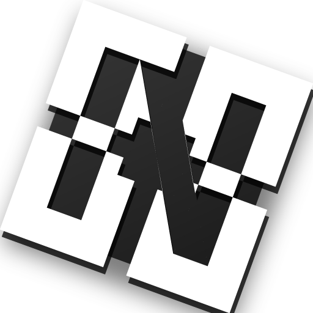

<p align="center">
  
</p>

<h1 align="center">NexStrap</h1>

<div align="center">

[](https://github.com/k153636/NexStrap/releases/latest)
[](https://github.com/k153636/NexStrap/releases/latest)
[](LICENSE)
[](https://discord.gg/PPrKt97jRn)

</div>

<p align="center">
  A Roblox launcher built for developers and power users —<br>
  with full <strong>Roblox Studio support</strong>, multi-instance play, deep Discord integration, and extensive customization.
</p>

> [!CAUTION]
> The only official place to download NexStrap is this GitHub repository. Any other sources are not affiliated with us.

> [!NOTE]
> NexStrap is not affiliated with Roblox Corporation.

---

## Features

**🎮 Discord Rich Presence**
- Game icon, name, creator, server region, and elapsed playtime
- **Multi-instance support** — tracks each Roblox window independently; displays the focused window's game in real time
- Automatically switches between NexStrap / Roblox / Studio Discord apps
- Join Game button with direct game link
- Graceful fallback for private or friends-only games
- Studio presence: Home / Editing / Testing states (via Roblox Studio plugin)

**🎭 Roblox Studio**
- Independent Studio install and launch — no official installer needed
- Discord presence with Home / Editing / Testing detection
- Separate Fast Flags profile for Studio

**⚡ Fast Flags**
- Edit `ClientAppSettings.json` flags directly
- Save and load named profiles
- Preset bundles: Graphics Lite, Render Optimized, Memory/CPU, Network
- Hot reload — apply flags to a running session without restart
- Bulk import from text

**👥 Friends**
- Real-time friends list with online / in-game presence
- Toast notifications when a friend comes online
- Avatar thumbnails and last-seen location

**👤 Multi-Account Manager**
- Manage multiple Roblox accounts
- Import cookies from Chrome — no password required
- One-click account switching
- Quick sign-in dialog

**📊 Play Stats**
- Total playtime, session count, and top games
- Per-game breakdown with 7-day bar chart

**🎨 Theme & UI**
- Glass UI with semi-transparent sidebar
- 8 accent colors + custom color picker
- Custom background image with blur and brightness controls
- Stretch resolution helper

**🔧 Mods**
- Import and enable / disable mod folders
- Apply textures, sounds, and fonts to Roblox's content directory

---

## Installing

Download the [latest release](https://github.com/k153636/NexStrap/releases/latest) and run `NexStrap.exe`.

You will need [.NET 9 Desktop Runtime](https://dotnet.microsoft.com/en-us/download/dotnet/9.0). If it's not installed, Windows will prompt you automatically.

> Windows SmartScreen may show a warning on first launch. Click **More info** → **Run anyway**. This happens because NexStrap is not yet code-signed.

---

## FAQ

**Q: Is this malware?**  
A: No. NexStrap is fully open source — the complete source code is available here on GitHub for anyone to verify.

**Q: Will I get banned from Roblox?**  
A: No. NexStrap does not interact with the Roblox client the way exploits do. It only manages launch settings, Fast Flags, and Discord Rich Presence.

**Q: Windows Defender flagged it**  
A: This is a false positive common with unsigned applications. You can review the full source code here to verify it is safe.

**Q: Does it work with multiple Roblox instances?**  
A: Yes. NexStrap tracks each instance independently and shows the focused window's game in your Discord status.

**Q: Does it work with Roblox Studio?**  
A: Yes. NexStrap can install and launch Studio independently, with full Discord presence support.

---

## Building from Source

```
git clone https://github.com/k153636/NexStrap.git
cd NexStrap
dotnet build NexStrap.sln -c Release
```

---

## Credits

- Built with [Avalonia](https://avaloniaui.net/) and .NET 9
- Discord RPC via [discord-rpc-csharp](https://github.com/Lachee/discord-rpc-csharp)
